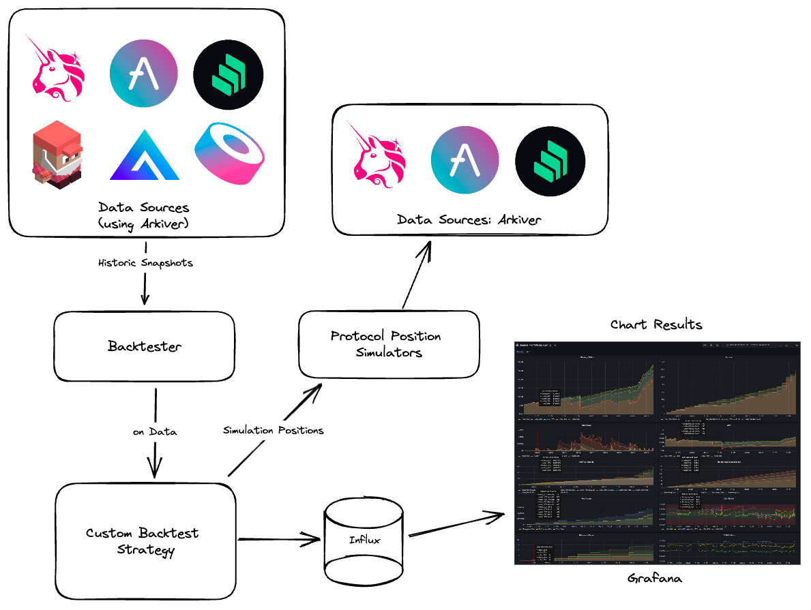
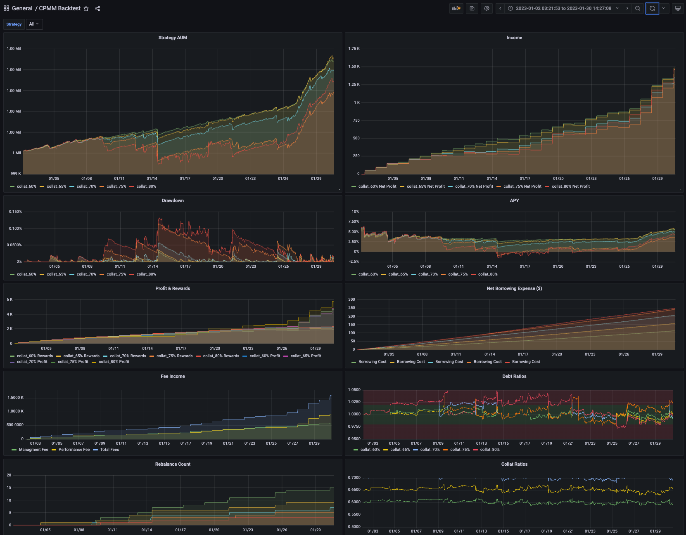

> [!WARNING]  
> This project is in early development. The API will change. Please use at your own risk. 

> [!NOTE]  
> What do we want?!?! More Datasources! More Pairs! We welcome PRs 🙏

# Web3 Backtest

Web3 Backtest is a generic Backtesting library for DeFi trading strategies. The library simplifies pullling historic data, simulating protocols, backtest metrics, charting and analytics.



## Historic Data

Web3 Backtester pull desired historic data using [arkiver](https://github.com/RoboVault/robo-arkiver). All data is formatted into snaphots with resolutions of 1m, 1h, or 1day. transaction- or block-resolution may be added in the future.

Datasources are specified with a simple configuration

```ts
const sources: DataSourceInfo[] = [
  {
    chain: 'arbitrum',
    protocol: 'camelot-dex',
    resoution: '1m',
    config: {
      pairs: [USDCWETH],
    },
  },
];
```

Supported sources are detailed [below](#Data Sources Supported)

## Position Simulation

The library contains helper classes that simulate openning, changing and closing defi positions. For example, the Univ2PositionManager will simulation a position with:

```ts
const univ2 = new UniV2PositionManager();
const position = univ2.addLiquidity('WETH/USDC', 1, 1900);
```

and as cycles pass in the backtest, the position can be monitored and altered

```ts
if (position.valueUsd < 2500) {
    { token0, token1 } = position.close()
}
```

Simulators are in the early stages, the API will change. See [Supported Positions Simulators](#Position-Simulators)

## Data storage and Analytics

There is a docker-compose.yml file that will spin up an influx db and a local instance of grafana so you can store any data you like during the backtest and have plenty of charting flexibility with grafana.



## Simplifying Code Structure

Web3 Backtester has a simple API that grants flexibility. The steps are:

1. Specify Data Sources
2. Specify Testing Period
3. Register Handlers
4. Run the backtest

Here's an example that creates a dummy backtest for a 10 day period, using Camelot 1m resolution data.

```ts
const main = async () => {
  const USDCWETH = '0x794a61358D6845594F94dc1DB02A252b5b4814aD';

  const bt = await Backtest.create(
    new Date('2023-01-01'),
    new Date('2023-01-02'),
    [
      {
        chain: 'arbitrum',
        protocol: 'camelot-dex',
        resoution: '1m',
        config: {
          pairs: [USDCWETH],
        },
      },
    ],
  );

  bt.onData(async (update: DataSnapshot<Univ2PoolSnapshot>) => {
    console.log(`we have data for ${update.timestamp}!`);
  });

  bt.onAfter(async () => {
    console.log('backtest complete!');
  });

  bt.run();
};

main();
```

# Features

| Feature                               | Status  |
| ------------------------------------- | ------- |
| Generic Data Sources                  | &check; |
| Generic Backtest API                  | &check; |
| Examples: Hedged Farming Strategy     | &check; |
| Multi-resolution Support (1m, 1d, 1h) | &check; |
| Influx boilerplate for charting       | &check; |
| NPM Module                            | &cross; |
| Example: AAVE Folding                 | &cross; |
| Wallet support for simulators         | &cross; |
| Local Data Caching                    | &cross; |

# Position Simulators

| Protocol      | Status  |
| ------------- | ------- |
| Univ3         | &check; |
| Univ2         | &check; |
| AAVE          | &check; |
| Masterchef V2 | &check; |
| Perp V2       | &cross; |
| Joes V2       | &cross; |
| GMX           | &cross; |

# Data Sources Supported

## AMMs

| Chain    | Protocol  | Minutely | Hourly  | Hourly  |
| -------- | --------- | -------- | ------- | ------- |
| Arbitrum | Camelot   | &check;  | &cross; | &cross; |
| Arbitrum | Sushiswap | &cross;  | &cross; | &cross; |
| Arbitrum | Univ3     | &cross;  | &cross; | &cross; |

## Lending Markets

| Chain     | Protocol | Minutely | Hourly  | Hourly  |
| --------- | -------- | -------- | ------- | ------- |
| Arbitrum  | AAVE     | &cross;  | partial | &cross; |
| Avalanche | AAVE     | &cross;  | partial | &cross; |

## Farms

| Chain    | Protocol  | Minutely | Hourly  | Hourly  |
| -------- | --------- | -------- | ------- | ------- |
| Arbitrum | Camelot   | &check;  | &cross; | &cross; |
| Arbitrum | Sushiswap | &cross;  | &cross; | &cross; |
| Arbitrum | Univ3     | &cross;  | &cross; | &cross; |

# Setup

## Influx and Grafana

Grafana and influx are not required to test strategies but they are useful tools for visualising the results.

Run Grafana and influx locally with docker

```
docker-compose up -d
```

You can stop the grafana and influx containers with

```
docker-compose down -v
```

## Run a Backtest

Install deps

```
npm install
```

Run the sample backtest

```
ts-node ./src/simple.ts
```

or run the larger example (required influx). First copy the .env template, then run

```
cp .env.template .env
ts-node ./src/examples/cpmm_camelot_aave/index.ts
```

# Graphana Vis

Your grafana instance is a fresh instance so there will be no dashboards, you'll need to create them. First step is setting up the influx data source with the following details

| Property       | Value                |
| -------------- | -------------------- |
| name           | backtester           |
| Query Language | InfluxQL             |
| URL            | http://influxdb:8086 |
| database       | backtest             |
| user           | admin                |
| password       | admin                |

To input the above data, go to: http://localhost:3000/ then click on the hamburger menu on the left. Proceed to connections then data sources then click "Add new data source" button. Search for InfluxDB and enter the aforementioned fields.

To add an example dashboard, navigate to Dashboards -> New -> Import and paste the json files provided in the `/grafana` folder.

__NOTE:__ If Grafana failed to connect to localhost, try setting connection mode to `server` use container name for the URL field. URL: http://influxdb:8086/

## Grafana Influx2 Datasource setup

Instructions [here](https://docs.influxdata.com/influxdb/v2/tools/grafana/?t=InfluxQL#configure-your-influxdb-connection)

* URL: http://host.docker.internal:8086
* Custom header: 
  * Header: Authorization 
  * Value: Token 1Vm2wdJdEM9BBxR8LHio1jjgAyx9Glm1SGQqQeBid5QPMqbvdIPjYxMhswV8AKKhA00s-ITdJgJqqJ6cX3cntA==
* Database: backtest
* User: admin
* Password: password


# Contributors and Supporters


[Robo Labs](https://www.robolabs.biz/) | [Neutra Finance](https://neutra.finance/) | [Liquity](https://www.liquity.org/) | [Sector Finance](https://sector.finance/)

If you would like to support the project, please contact us on [Twitter](https://twitter.com/robolabs_biz).
# Robo Labs

If your looking for to build custom backtests for you, using this library, hit up [Robo Labs](https://www.robolabs.biz/) on Twitter [@robolabs_biz](https://twitter.com/robolabs_biz).

